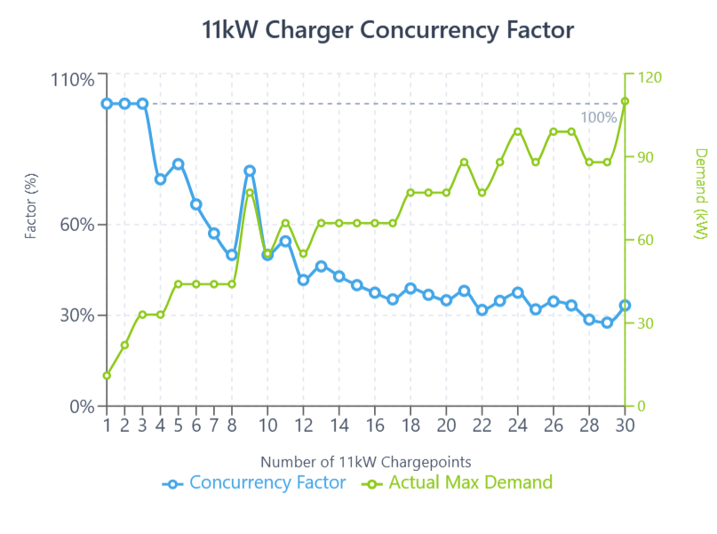

# EV Charging Testing Task

## Task Description
The detailed task description can be found in [takehome.pdf](takehome.pdf).

## Demo
Here are visual demonstrations of the solution:

Simulation Demo


Frontend App


## How To Run

To run the simulation:
```bash
npm run simulation
```

To run the frontend:
```bash
npm run start
```

## (Bonus) Concurrency Factor Results


--- Concurrency Factor Experiment Summary ---
CP Count | Actual Max Demand (kW) | Concurrency Factor (%)
---------|------------------------|-----------------------
       1 |                   11.0 |                   100.0
       2 |                   22.0 |                   100.0
       3 |                   33.0 |                   100.0
       4 |                   33.0 |                    75.0
       5 |                   44.0 |                    80.0
       6 |                   44.0 |                    66.7
       7 |                   44.0 |                    57.1
       8 |                   44.0 |                    50.0
       9 |                   77.0 |                    77.8
      10 |                   55.0 |                    50.0
      11 |                   66.0 |                    54.5
      12 |                   55.0 |                    41.7
      13 |                   66.0 |                    46.2
      14 |                   66.0 |                    42.9
      15 |                   66.0 |                    40.0
      16 |                   66.0 |                    37.5
      17 |                   66.0 |                    35.3
      18 |                   77.0 |                    38.9
      19 |                   77.0 |                    36.8
      20 |                   77.0 |                    35.0
      21 |                   88.0 |                    38.1
      22 |                   77.0 |                    31.8
      23 |                   88.0 |                    34.8
      24 |                   99.0 |                    37.5
      25 |                   88.0 |                    32.0
      26 |                   99.0 |                    34.6
      27 |                   99.0 |                    33.3
      28 |                   88.0 |                    28.6
      29 |                   88.0 |                    27.6
      30 |                  110.0 |                    33.3
